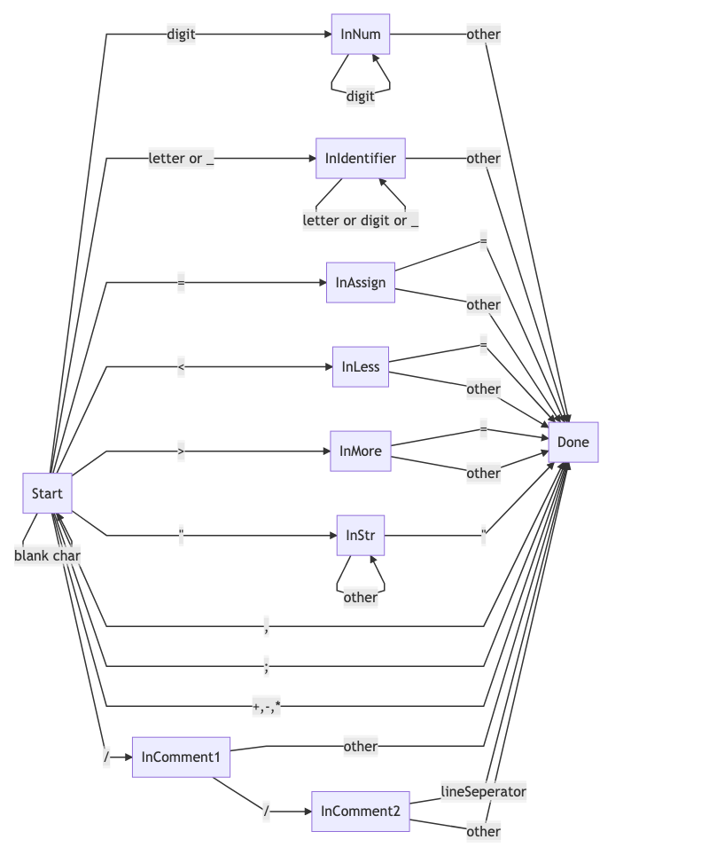

# Simple

Simple是一个简单的语言，这个项目是设计Simple语言，以及实现Simple编译器前端。

Simple语言主要的语言特性：

简单变量、简单常量、简单四则运算、简单布尔运算、顺序结构、选择结构、do-while循环和赋值语句等语言特性.


这是一份简单的Simple源码:

```
// 语法分析测试
// 变量定义测试
int a,b,c;

// 赋值测试
a = "a_str";
b = b + c;

// if then else end测试
if a < 0
then
        a = 1;
else
        a = 3;
end;

// do while测试
// 顺便测试bool-exp
do
a = a + 1;
while a < 2 && b > a;

// 四则运算测试
a = 1 + 2*4 -4/5;

// if else优先级测试
if a > b
    then
    if b > c
       then
       c = b;
       else
       b = c;
    end;
end;
```


## 词法和语法规则

在Simple语言中，词法的规则如下(自顶向下定义)：

```
简单变量 = (字母|下划线)(字母|下划线|数字)*

简单常量 = int常量 | 字符串常量

Int常量 = 数字

字符串常量 = “(不为双引号字母)*”

字母 = [a-z] | [A-Z]

下划线 = _

数字 = [0-9]([0-9])*

简单四则运算 = + | - | * | /

简单布尔运算 = && | || | ! (C语言中的and、or、not)

比较运算: > | < | >= | <= | == | !=

单行注释: //（不为换行符的字符）*

保留字: if then else end do while int string bool
```


语法规则如下:

```
program -> statement;stmt_seq // 至少有一条语句

stmt_seq -> (statement;)* // // 一条或者多条语句，以逗号结尾

statement -> define-stmt | if-stmt | assign-stmt | while-stmt

define-stmt -> type id-list

if-stmt -> if bool-exp then stmt_seq end | if bool-exp then stmt_seq else stmt_seq end

assign-stmt -> id = arithmetic-exp | const_str

while-stmt -> do stmt_seq while bool-exp
```


## 词法分析

根据词法分析中定义的正则表达式，画出DFA之后再进行代码实现。其中DFA如下:



注: 在master分支中的Simple的词法分析是用Lex工具实现的，这里补上手工构造词法分析器的代码。
